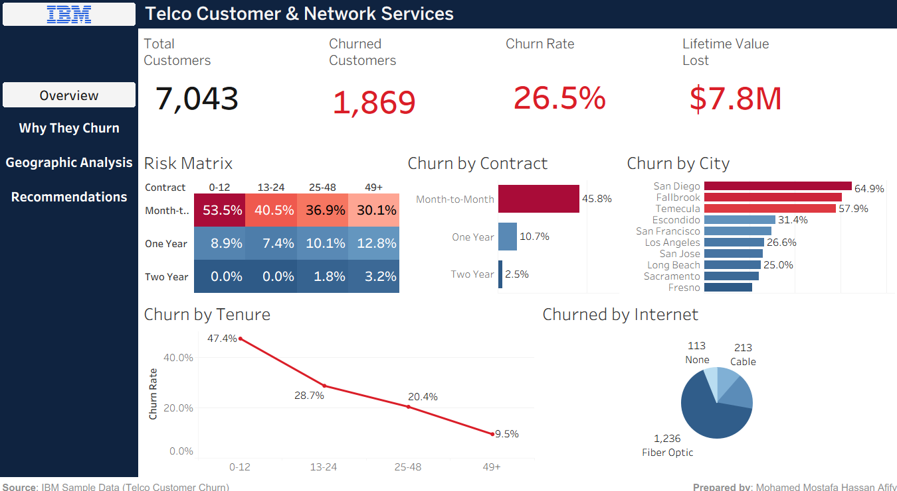
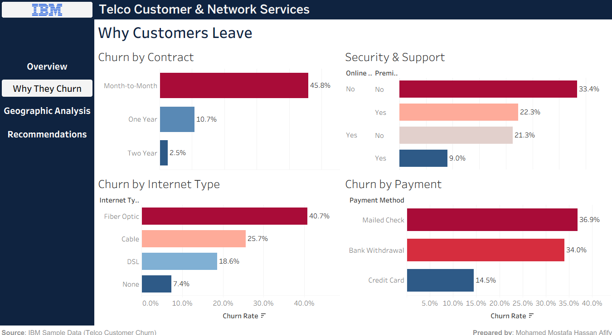
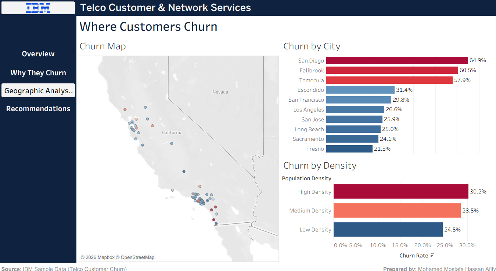
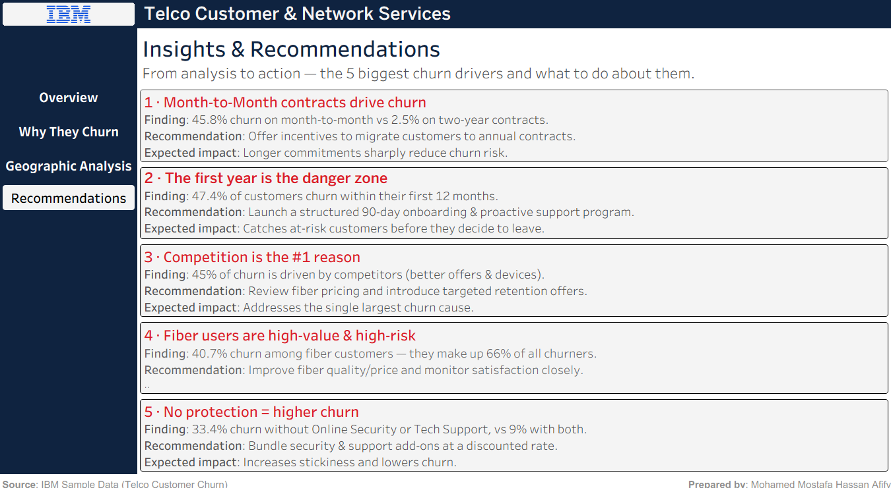
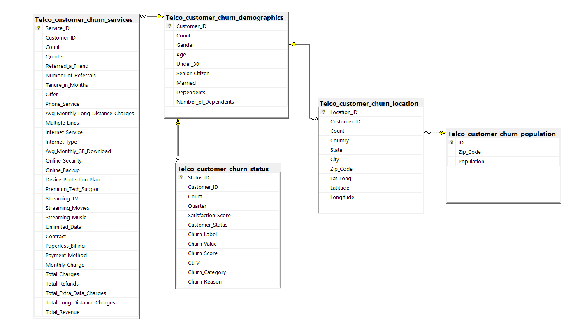
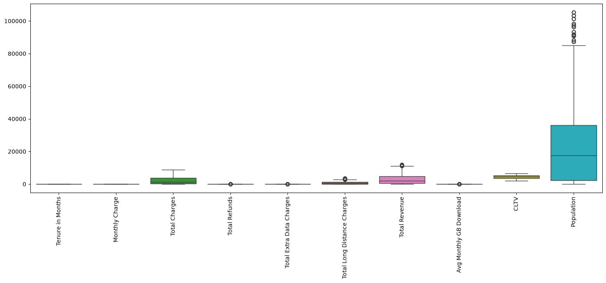
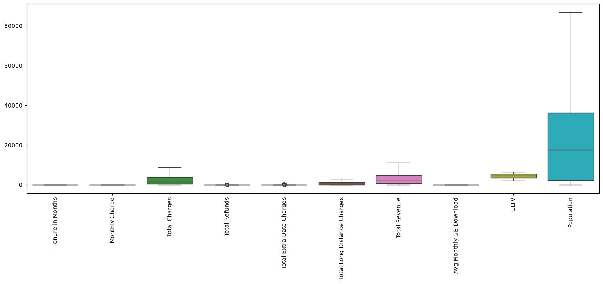
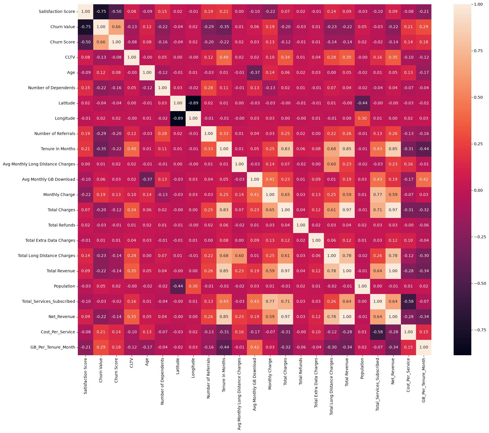
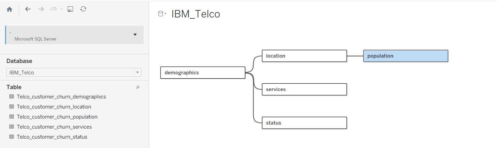

# Customer Churn Analysis — IBM Telco

**An end-to-end data analysis project: from five raw relational tables to an interactive dashboard suite and a data-backed retention strategy.**


---

## Overview

A telecommunications provider operating in California is losing **26.5% of its customer base**. This project integrates five separate tables covering **7,043 customers**, cleans and prepares the data, interrogates it with SQL, and communicates the findings through four connected Tableau dashboards — ending in five recommendations that are each tied to a specific number.

**The question behind the project:** *who is leaving, why, where — and what should the business do about it?*

---

## Headline results

| Metric | Value |
| :--- | :--- |
| Customers analysed | 7,043 |
| Customers lost | 1,869 |
| Churn rate | **26.5%** |
| Customer lifetime value lost | **≈ $7.8M** |
| Biggest single driver | Month-to-month contracts — **45.8%** churn vs **2.5%** on two-year |

---

## Dashboards

### 1 · Overview — the size and shape of the problem
The Churn Risk Matrix (contract × tenure) shows exactly where risk concentrates: a new month-to-month customer churns at **53.5%**, a long-tenured two-year customer at **2%**.



### 2 · Why they churn — the drivers
Contract type, internet type, payment method and the security/support bundle.



### 3 · Where they churn — geography
A California map plus the highest-churn cities and the effect of population density.



### 4 · Insights & recommendations — from analysis to action
Five findings, each paired with a recommendation and its expected impact.



---

## Key insights

| # | Finding | Evidence |
| :-- | :--- | :--- |
| 1 | **Contract length is the strongest predictor of churn** | 45.8% month-to-month vs 2.5% two-year |
| 2 | **The first year is the danger zone** | 47.4% churn within 12 months, falling to 9.5% after four years |
| 3 | **Competition is the number-one stated reason** | 45% of churn falls under the *Competitor* category |
| 4 | **Fiber customers are high-value and high-risk** | 40.7% churn; they make up 66% of all churners |
| 5 | **Missing protection drives churn** | 33.4% churn without Online Security or Tech Support, vs 9% with both |
| 6 | **Seniors are the most vulnerable age group** | 41.7% churn for 65+, nearly double every other group |
| 7 | **Family commitment mirrors service commitment** | Married with dependents churn at 4.2%, single with none at 34.4% |
| 8 | **Churners pay more and are less satisfied** | $74 vs $63 monthly; satisfaction 1.7 vs 3.8 out of 5 |

---

## Recommendations

1. **Move customers onto longer contracts** — incentives to migrate away from month-to-month.
2. **Build a structured 90-day onboarding programme** — nearly half of churn happens in year one.
3. **Review fiber pricing and launch targeted retention offers** — competition drives 45% of churn.
4. **Protect the fiber segment** — highest churn rate and the largest share of churners.
5. **Bundle security and tech support at a discount** — the single cheapest way to increase stickiness.

---

## Data

The dataset is IBM's public sample **Telco Customer Churn** data. The operator it describes is a fictional California-based telecom, so *IBM* here refers to the source of the sample data, not the company under analysis.

Five related tables, **7,043 customers**, quarter Q3:

| Table | Grain | Notes |
| :--- | :--- | :--- |
| `demographics` | 1 row / customer | age, gender, marital status, dependents |
| `location` | 1 row / customer | city, zip code, latitude, longitude |
| `services` | 1 row / customer | contract, internet, add-ons, charges |
| `status` | 1 row / customer | churn label, reason, satisfaction, CLTV |
| `population` | 1 row / **zip code** | joins through `location`, not the customer |



---

## Repository structure

```
IBM-Telco-Customer-Churn/
├── notebooks/      Python EDA, cleaning and preprocessing pipeline
├── sql/            SQL storytelling queries (5 themes, 15 questions)
├── tableau/        Packaged Tableau workbook (.twbx)
├── docs/           Project document (EN + AR) and the raw data profile
├── presentation/   Final deck and the Arabic presentation script
├── images/         Dashboard exports and analysis figures
└── data/           Raw source tables
```

---

## Method

### 1 · Database (SQL Server)
The five tables were imported into a SQL Server database (`IBM_Telco`) with primary and foreign keys defined. The four customer tables relate on `Customer_ID`; `population` relates to `location` on `Zip_Code`, producing a star schema with the customer at the centre.

### 2 · Python pipeline
Eleven steps across four stages:

| Stage | Steps |
| :--- | :--- |
| **Prepare** | load five tables · profile every column · merge into one customer table |
| **Clean** | domain-aware missing values · IQR outlier capping · skewness analysis |
| **Engineer** | four business features · correlation and multicollinearity check |
| **Model-ready** | one-hot encoding · drop near-constant columns · 80/20 stratified split · MinMax scaling |

Three decisions worth highlighting:

**Guard against zeroing a sparse column.** `Total Refunds` is mostly zeros, so `Q1 = Q3 = 0`. Un-guarded IQR capping would clip the entire column to a single value:

```python
for col in outlier_cols:
    iqr = q3 - q1
    if iqr == 0:
        continue          # skip: capping would destroy the column
    df[col] = df[col].clip(upper=q3 + 1.5 * iqr)
```

**Fill missing values with meaning, not with the mode.** A blank `Offer` means no promotion was given — that is information, not absence of it:

```python
df['Offer']         = df['Offer'].fillna('No Offer')
df['Internet Type'] = df['Internet Type'].fillna('No Internet Service')
```

**Split before scaling.** Fitting the scaler on all rows leaks test-set statistics into training:

```python
X_train, X_test, y_train, y_test = train_test_split(X, Y, test_size=0.2, stratify=Y)
X_train[cols] = scaler.fit_transform(X_train[cols])
X_test[cols]  = scaler.transform(X_test[cols])
```

Leakage columns (`Churn_Label`, `Customer_Status`, `Churn_Score`, `Churn_Category`, `Churn_Reason`) were dropped before modelling — they are known only because the outcome is known.

<details>
<summary><b>Outlier capping — before and after</b></summary>




</details>

<details>
<summary><b>Correlation heatmap</b></summary>



</details>

### 3 · SQL storytelling
Fifteen queries grouped into five themes — how big the churn is, who is leaving, where they are, why they leave, and the value at risk — using `JOIN`, `CASE`, `HAVING`, `ISNULL` and window functions. Example:

```sql
SELECT
    Churn_Category,
    COUNT(*) AS Category_Count,
    CAST(COUNT(*) AS FLOAT) * 100 / SUM(COUNT(*)) OVER() AS Percentage
FROM Telco_customer_churn_status
WHERE Churn_Category IS NOT NULL
GROUP BY Churn_Category
ORDER BY Category_Count DESC;
```

### 4 · Tableau
Tableau connects directly to SQL Server and combines the tables with **Relationships** rather than physical joins, preserving each table's level of detail and preventing row duplication.



Four dashboards are linked by a custom sidebar with navigation buttons, using IBM's Carbon colour system — a blue-to-red diverging scale encodes churn severity so risk can be read instantly by colour.

---

## Tools

| Layer | Tools |
| :--- | :--- |
| Storage & querying | Microsoft SQL Server (T-SQL, SSMS) |
| Analysis | Python — pandas, NumPy, scikit-learn, seaborn, matplotlib |
| Visualisation | Tableau Desktop (dashboards, story, maps) |
| Reporting | Word, PowerPoint |

---

## Getting started

```bash
git clone https://github.com/<your-username>/IBM-Telco-Customer-Churn.git
cd IBM-Telco-Customer-Churn
pip install pandas numpy scikit-learn seaborn matplotlib openpyxl
jupyter notebook notebooks/IBM_Telco_EDA_Cleaning_Preprocessing.ipynb
```

To explore the dashboards, open `tableau/` in Tableau Desktop or Tableau Public.

---

## Author

**Mohamed Mostafa Hassan Afify**
Data Analyst — NTI · Creativa, Data Analysis & Freelancing programme

---

<sub>Dataset: IBM sample data (Telco Customer Churn). The operator described in the data is fictional.</sub>
